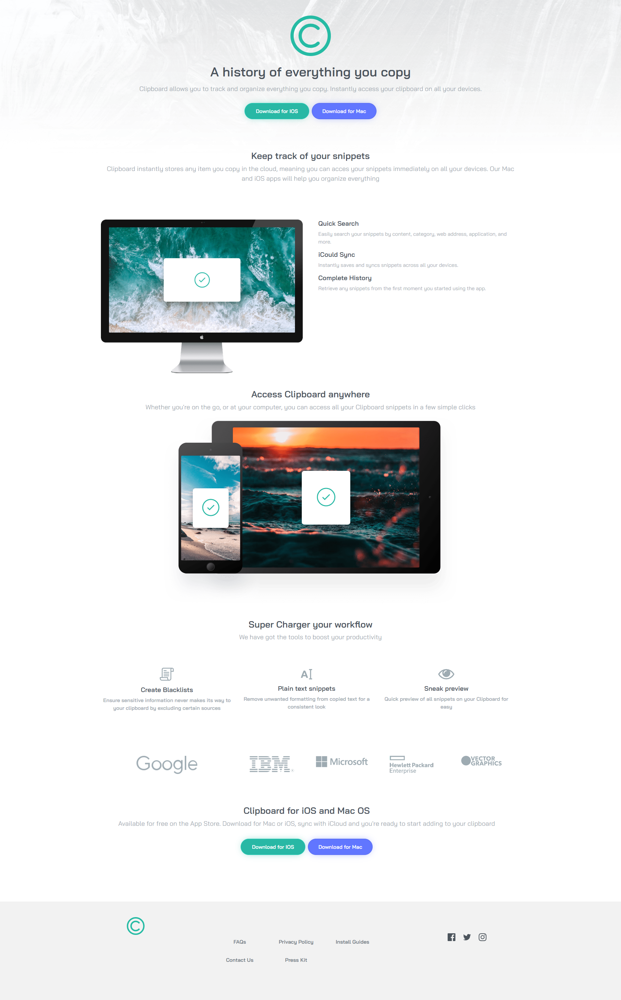

# Frontend Mentor - Clipboard landing page solution

This is a solution to the [Clipboard landing page challenge on Frontend Mentor](https://www.frontendmentor.io/challenges/clipboard-landing-page-5cc9bccd6c4c91111378ecb9). Frontend Mentor challenges help you improve your coding skills by building realistic projects. 

## Table of contents

- [Overview](#overview)
  - [The challenge](#the-challenge)
  - [Screenshot](#screenshot)
  - [Links](#links)
- [My process](#my-process)
  - [Built with](#built-with)
  - [What I learned](#what-i-learned)
  - [Continued development](#continued-development)
- [Author](#author)

## Overview

### The challenge

Users should be able to:

- View the optimal layout for the site depending on their device's screen size
- See hover states for all interactive elements on the page

### Screenshot

### Links

- Solution URL: [solution URL ](https://www.frontendmentor.io/solutions/clipboard-landing-page-bZCTMiMBNd)
- Live Site URL: [Live site URL](https://abdelmouizz.github.io/clipboard-landing-page-master/)

## My process

### Built with

- Semantic HTML5 markup
- CSS custom properties
- Flexbox
- CSS Grid
- Mobile-first workflow
- [Bootstrap 5](https://getbootstrap.com/) - Bootstrap 5 

### What I learned

In this project I learnt to use to more Bootstrap 5 and its features and especially getting used and familiar with Bootstrap Grid which was quite helpful to use

### Continued development

I wanna continue learning more about CSS Flexbox and learn more using Bootstrap 5 Flexbox and Grid.

## Author

- Website - [Abdelmouiz Chabane]
- Frontend Mentor - [@abdelmouizz](https://www.frontendmentor.io/profile/abdelmouizz)

